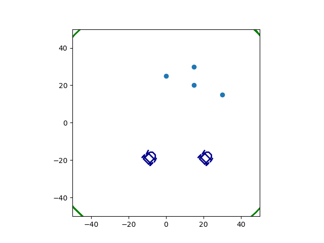
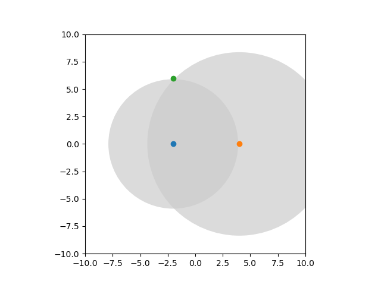
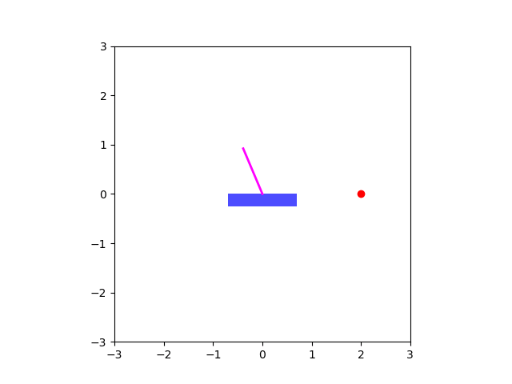

# Kalman Filter MOOC
(see [KalMOOC](https://www.ensta-bretagne.fr/jaulin/kalmooc.html))

### Localization with **Kalman Filter**

The robots can measure angles (with a *goniometer*) from landmarks or from the other robot if the distance is small.
Using these measurements, each robot can estimate its position and we show how their covariance evolve.

### Tracking with **Extended Kalman Filter**

A robot is localized and tracked from two noisy radars using an EKF.

### Regulation and state observation with **Extended Kalman Filter**

An inverse pendulum is regularized using an EKF for state observation.

